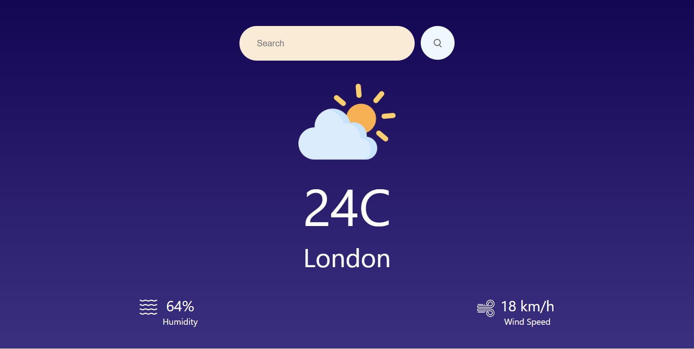

# Weather App

A simple weather application built with React that allows users to check the current weather conditions for a specific city.

## Features

- **Search:** Users can enter the name of a city to get the current weather details.
- **Weather Icons:** Display of weather icons based on the current weather conditions.
- **Temperature Conversion:** The temperature is displayed in Fahrenheit initially and can be easily converted to Celsius.
- **Humidity and Wind Speed:** Information about humidity percentage and wind speed in km/h is provided.
- **Responsive Design:** The app is designed to be responsive and user-friendly.

## Technologies Used

- React
- OpenWeatherMap API

## Getting Started

To get started with the Weather App, follow these steps:

1. Clone the repository: `git clone https://github.com/akifalbayrak/weather-app.git`
2. Install dependencies: `npm install`
3. Obtain an API key from [OpenWeatherMap](https://home.openweathermap.org/api_keys) and replace `YOUR_API_KEY` in the code with your key.
4. Run the app: `npm start`

## Usage

1. Enter the name of a city in the search bar.
2. Click the search icon to fetch and display the current weather details.
3. Explore the temperature, location, humidity, and wind speed information.

## Screenshots

## Acknowledgments

- Weather icons provided by [OpenWeatherMap](https://openweathermap.org/weather-conditions)

